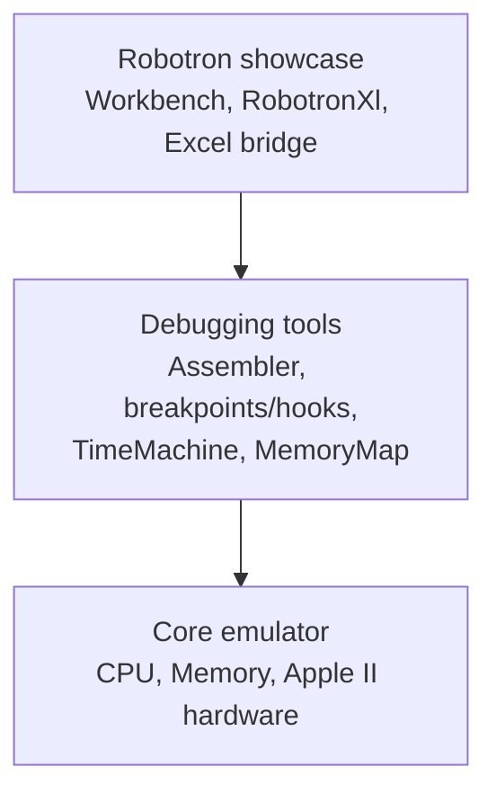
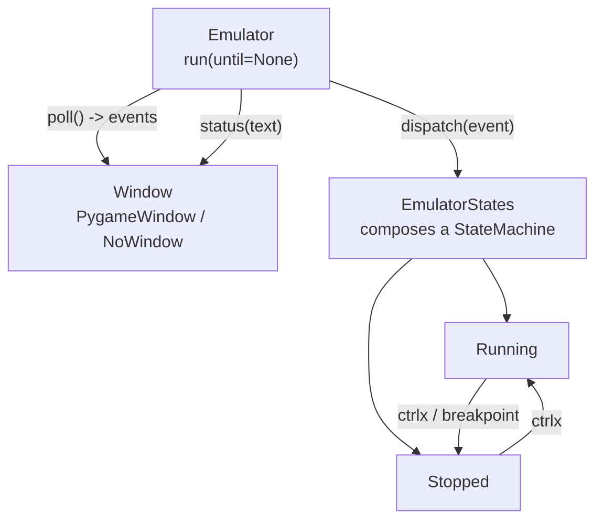

# papple2

**A small Apple II emulator written in Python, built as a debugging instrument rather than a player.**

---

## Vision

`papple2` is a small Apple II emulator written in Python. It is not meant to compete with full emulators on speed or completeness. Its purpose is to be a debugging instrument: a machine I can stop, inspect, rewind, and script from Python while it runs Apple II code.

The core comes from ApplePy by James Tauber, ported to Python 3 and stripped of what I did not need (the socket interface). Around that core I built tools that a normal emulator does not offer: an assembler and disassembler, breakpoints and hooks, a time machine that rewinds CPU and memory state, a log of every memory access, and a map of which instructions were executed and how control flowed between them.

**Core philosophy:**

- **Understandability over speed.** Python is slow for emulation, but that never mattered for the debugging use. What mattered was that the whole emulator is a few thousand lines I can read, change, and extend in an afternoon, and that the debugging tools can be written in the same language as the emulator, with no bridge in between.
- **A debugging instrument, not a player.** The point isn't to run Apple II software well -- it's to run it *observably*: stoppable, inspectable, rewindable, scriptable.
- **Runs with and without a screen.** The pygame window is for watching and interacting. Silent mode (`Emulator(no_display=True)`) is for tests and scripted analysis: boot, run to a point, press keys from code, read the buffers, done.

---

## Architecture

### Target package split (M4, not yet done)

Today `papple2` contains core emulator, debugging tools, and Robotron-specific code all mixed together in one package. The plan is a clean three-layer split:



The showcase depends on the debugging tools, which depend on the core -- never the other way around. This is what makes `papple2` reusable outside the Robotron project. Not yet built; see `GOALS.md` for where this sits in the roadmap.

### Emulator / Window / States (current, as of M2.5)

This part is real and current, as of the M2.5 refactor (`HISTORY.md`, 2026-09-11). `Emulator.run` no longer touches pygame directly -- it polls a `Window`, dispatches whatever comes back to `EmulatorStates`, and lets `EmulatorStates` decide what that means:



`PygameWindow` and `NoWindow` share the same three methods (`poll`, `present`, `status`), so `Emulator` doesn't know or care whether a window exists. A watcher firing -- a real breakpoint, or an `until` condition passed to `run` -- dispatches the same `breakpoint` event that `ctrlx` uses, so `Running` -> `Stopped` always goes through the state machine, never around it.

---

## Settled decisions

This section is more useful to an LLM picking this project back up than to me -- which is exactly why it's here: `README.md` rides along in every session's `filesdump.txt` by default.

- **`papple2` is a real, installable Python package** (`src/papple2/`, `pyproject.toml`, editable install via `make setup`). Internal imports are prefixed (`from papple2.X import Y`); star-imports (`from papple2.X import *`) are kept as-is on purpose for now -- converting to explicit names is M4 work.
- **Python 3.12 for the venv, not whatever `python3` resolves to.** `pygame` 2.6.1 doesn't build or run correctly under Python 3.14 as of this writing (open upstream issue).
- **Paths come from `papple2.toml`** (local, gitignored; `papple2.example.toml` committed), not hardcoded Windows strings, and not `os.chdir`.
- **`EmulatorStates` composes a `StateMachine` rather than subclassing one.** It's the root of its own state tree and is never handed to code that expects a plain `StateMachine` -- the case for composition over inheritance. The individual states (`EmulatorRunningState`, `EmulatorStoppedState`) do legitimately subclass `StateMachine`, since they're genuinely registered as states via `add_state`.
- **The window (pygame) is a separate, swappable layer, not baked into `Emulator`.** `src/papple2/Window.py`'s `PygameWindow`/`NoWindow` share `poll() -> list`, `present()`, `status(text)`; `Emulator.__init__` picks one based on `no_display`. `Emulator.run`/`event_loop` and the state handlers contain no pygame reference.
- **A watcher firing dispatches `Event('breakpoint')` into the state machine, rather than hard-returning out of `run`.** Separately, `run(until=...)` returns to its caller once execution stops for any reason; a plain `run()`/`event_loop()` call (no `until`) keeps looping through pauses as before, and only stops on `halt`.
- **`time.monotonic()`, not `pygame.time.get_ticks()`, for frame pacing** -- works identically whether or not a window exists.
- **`QUIT` (closing the window) and the Print key both map to the same `halt` event.** There's no separate hard-exit path. Print exists mainly for the Windows heritage of this code; on macOS, closing the window is the primary way to trigger it.

---

## Relation to sibling projects

**`load-runner`:** a private educational project porting an Apple II game to Godot. `papple2` can help two ways: cycle counting, if timing fidelity turns out to matter for the port; and level extraction, by letting the original code load a level into memory and then reading the filled buffers instead of reverse-engineering the disk format by hand. Not started yet.

**`a2-hires-lab`:** a standalone Excel/VBA lab exploring Apple II hi-res graphics mechanics, built around Chapter 3 of the `load-runner` disassembly. No shared code or repo with `papple2`. Its NTSC color decision table, once fully verified by hand against the chapter's worked examples, is meant to become test fixtures for `papple2`'s `Display.update_hires`, which currently uses a simplified per-pixel color model with no neighbor-adjacency rules. That handoff hasn't happened yet.

---

## Running

```bash
make setup   # create the venv (Python 3.12), install dependencies in editable mode
make test    # run the pytest suite
make run     # boot Robotron with the pygame window open
```

`make setup` will happily produce a broken install if your default `python3` resolves to 3.14. If needed: `rm -rf .venv && python3.12 -m venv .venv && make setup`.

---

## Technical notes & gotchas

- **`pygame` 2.6.1 does not build or run correctly under Python 3.14** -- `pygame.mixer` and `pygame.font` fail to import. Open upstream packaging issue, not specific to this machine. Use Python 3.12 for the venv until that's resolved.
- **A checkpoint that pauses execution (a real breakpoint, or an `until` condition) stays registered after it fires.** If something resumes via `ctrlx` within the same `run()` call and the checkpoint's condition is still true, it re-fires immediately. `run(until=...)`'s own checkpoint is cleaned up automatically at the start of the next `run()` call, so this only affects hand-registered checkpoints (`add_checkpoint`) used interactively -- none are currently active by default.
