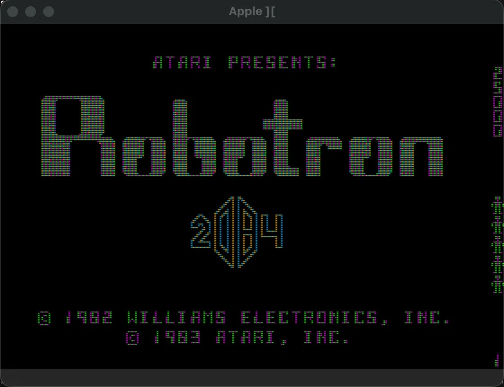
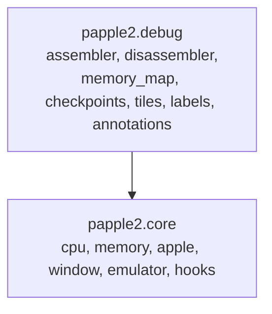
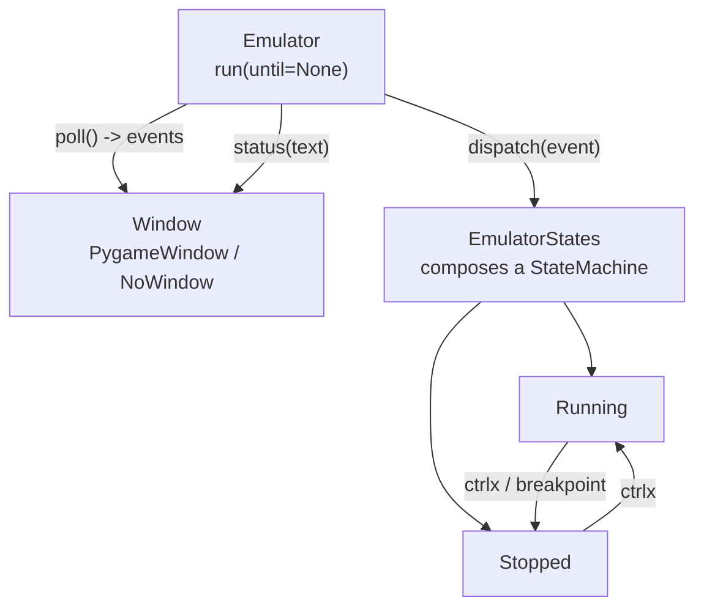
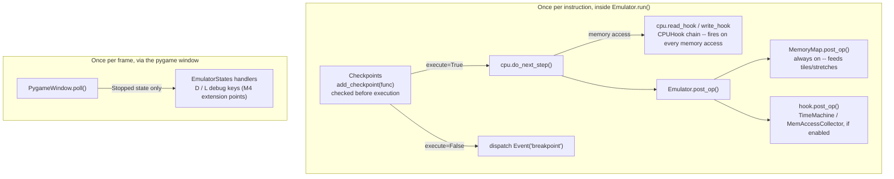
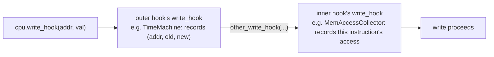
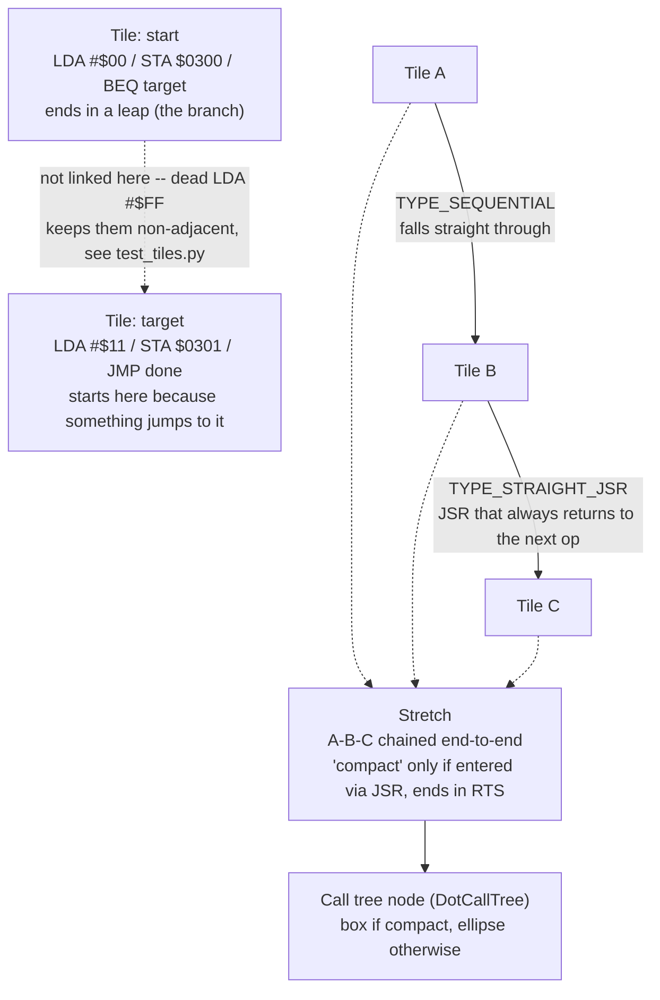
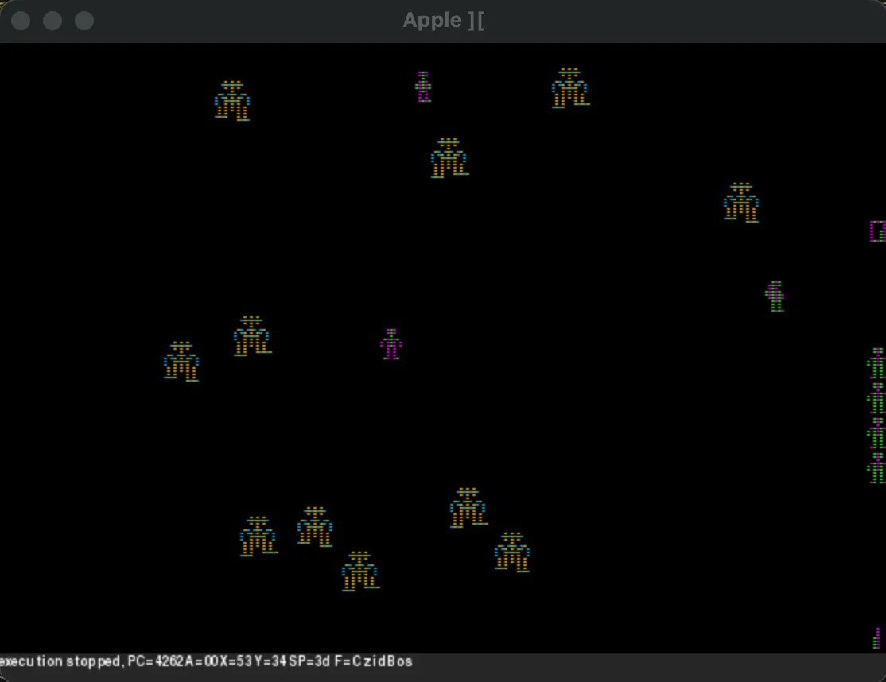
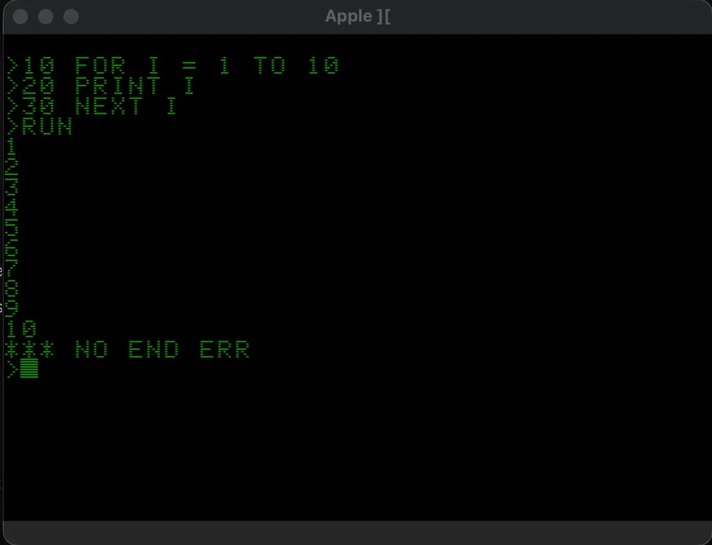

# papple2

**A small Apple II emulator written in Python, built as a debugging instrument rather than a player.**

---

## Vision

`papple2` is a small Apple II emulator written in Python. It is not meant to compete with full emulators on speed or completeness. Its purpose is to be a debugging instrument: a machine I can stop, inspect, rewind, and script from Python while it runs Apple II code.

The core comes from ApplePy by James Tauber, ported to Python 3 and stripped of what I did not need (the socket interface). Around that core I built tools that a normal emulator does not offer: an assembler and disassembler, breakpoints and hooks, a time machine that rewinds CPU and memory state, a log of every memory access, and a map of which instructions were executed and how control flowed between them.



*The Robotron 2084 splash screen, running through `make run` -- `papple2`'s original and still hardest test case.*

**Core philosophy:**

- **Understandability over speed.** Python is slow for emulation, but that never mattered for the debugging use. What mattered was that the whole emulator is a few thousand lines I can read, change, and extend in an afternoon, and that the debugging tools can be written in the same language as the emulator, with no bridge in between.
- **A debugging instrument, not a player.** The point isn't to run Apple II software well -- it's to run it *observably*: stoppable, inspectable, rewindable, scriptable.
- **Runs with and without a screen.** The pygame window is for watching and interacting. Silent mode (`Emulator(no_display=True)`) is for tests and scripted analysis: boot, run to a point, press keys from code, read the buffers, done.
- **A second course in Python, this time on shape.** This project taught me Python the first time. This round it's teaching me how a Python project is shaped when it's meant to be reused: package layout, pytest, and separating a library from the programs that use it. `pysm` stays in the project for the same reason, even where a simpler mechanism would do -- state machines are part of what I want practice with.

---

## Architecture

### Package split (M4, done 2026-09-12)

`papple2` is split into two layers:



`papple2` has no in-repo showcase anymore. `probotron` (the Robotron 2084 disassembly) depends on `papple2` as an installed package from outside this diagram, the same way `load-runner` or `a2-hires-lab` could.

`Hooks` lives in `papple2.core`, not `papple2.debug` as an earlier version of this diagram had it: `Emulator.__init__` unconditionally constructs `TimeMachine`/`MemAccessCollector` (the `time_machine`/`mem_access` flags only control whether they're activated, not whether they exist), so `Emulator` cannot run at all without `Hooks` importable. The split follows that real coupling.

### Emulator / Window / States (current, as of M2.5)

This part is real and current, as of the M2.5 refactor (`HISTORY.md`, 2026-09-11). `Emulator.run` no longer touches pygame directly -- it polls a `Window`, dispatches whatever comes back to `EmulatorStates`, and lets `EmulatorStates` decide what that means:



`PygameWindow` and `NoWindow` share the same three methods (`poll`, `present`, `status`), so `Emulator` doesn't know or care whether a window exists. A watcher firing -- a real breakpoint, or an `until` condition passed to `run` -- dispatches the same `breakpoint` event that `ctrlx` uses, so `Running` -> `Stopped` always goes through the state machine, never around it.

### Extension points

`papple2` has four genuinely different ways to attach behavior to a running program, at different points in the per-instruction and per-frame loop. They tend to get lumped together in conversation as "hooks," but they're not the same mechanism, and flattening them into one diagram would teach something wrong:

- **Checkpoints** (`add_checkpoint(func)`) run once per instruction, *before* it executes, and can stop execution (`execute=False`). This is how breakpoints and `KeyScript` work.
- **`CPU` read/write hooks** (`cpu.read_hook`/`cpu.write_hook`) fire mid-instruction, on every actual memory access. `CPUHook` and its subclasses `TimeMachine`/`MemAccessCollector` chain rather than replace each other here.
- **`MemoryMap`** isn't pluggable at all -- `Emulator.post_op()` feeds it unconditionally, once per instruction, after execution. This is what tiles and stretches are built from.
- **Debug-key handlers** (`EmulatorStates.stopped_state`/`running_state`) are keyed to pygame frames and the `D`/`L` keys, not instructions -- the M4 extension points `tests/test_emulator_debug_keys.py` demonstrates.



The `CPUHook` chain from the diagram above, in detail: `enable_write_hook` always stashes whatever was already installed on `cpu.write_hook` as `other_write_hook`, then installs its own -- so which hook ends up outer or inner depends on enable order, not a fixed rule.



### Tiles, stretches, and call trees

`papple2.debug.tiles` turns raw instruction data into a Graphviz call-flow graph, the way `probotron`'s workbench visualizes disassembled control flow. Three concepts, in increasing order of how settled they are:

- **Tile** -- a basic block: a run of instructions that always execute one after another. A tile always ends at a leap (branch, jump, call, or return) and always starts where something else jumps to. This maps cleanly onto the standard "basic block" idea and isn't in question.
- **Stretch** -- a chain of tiles linked end-to-end because control flow between them is fixed and predictable (falls straight through, an always-taken branch, or a `JSR` that always returns to the next instruction). Still an open question, in the code's own words: "whether 'stretch' is pulling its own weight as a concept, or whether it should be reworked or folded into something else -- revisit before extending this further."
- **Call tree** -- `DotCallTree` turns stretches into the actual Graphviz graph: one node per stretch (a box if "compact" -- entered only via `JSR`, ends in `RTS` -- an ellipse otherwise), with arrows for branches, calls, jumps, and unmatched returns.

The two tiles below are `test_tiles.py`'s real `BRANCH_PROGRAM` -- a genuine, if deliberately unlinked, example (a dead byte keeps the branch and its target physically apart, so the automatic linker's "consecutive" check never fires). The three-tile stretch to its right is illustrative, showing what a chain looks like when tiles *do* link up:



---

## Relation to sibling projects

**`probotron`:** the Robotron 2084 disassembly and its Excel/PyXLL workbench, carved out of `papple2` in M7.5. Depends on `papple2` as an installed package rather than living inside it -- the `papple2.core`/`papple2.debug` split exists to serve exactly this kind of outside consumer. `tests/test_robotron.py` remains here as `papple2`'s own manual smoke test of the with-window path.

**`load-runner`:** a private educational project porting an Apple II game to Godot. `papple2` can help two ways: cycle counting, if timing fidelity turns out to matter for the port; and level extraction, by letting the original code load a level into memory and then reading the filled buffers instead of reverse-engineering the disk format by hand. Not started yet.

**`a2-hires-lab`:** a standalone Excel/VBA lab exploring Apple II hi-res graphics mechanics, built around Chapter 3 of the `load-runner` disassembly. No shared code or repo with `papple2`. Its NTSC color decision table, once fully verified by hand against the chapter's worked examples, is meant to become test fixtures for `papple2`'s `Display.update_hires`, which currently uses a simplified per-pixel color model with no neighbor-adjacency rules. That handoff hasn't happened yet.

---

## Testing strategy

`papple2` is verified at two tiers, deliberately:

- **Automated (`make test`).** The pytest suite covers 6502 instruction semantics and the classic hardware quirks, Apple II specifics (soft switches, the hi-res memory buffer), running headless with and without checkpoints/breakpoints, and the debugging hooks (`TimeMachine`, `MemAccessCollector`). All of it runs with `no_display=True` -- no pygame window involved, and none of it can be, meaningfully: a headless run has no way to assert "does this look right on screen."
- **Manual, with-window (`make run`).** Runs `tests/test_robotron.py`, a single `@pytest.mark.manual` test that boots `Emulator(no_display=False)` with the real `ROBOTRON.BIN` and calls `run()` with no `until` -- the same path the old in-repo Robotron showcase exercised, but with zero dependency on `probotron`'s workbench or Excel bridge.
- **Manual, with-window, text mode (`make run-text`).** Runs `tests/test_text.py`, also `@pytest.mark.manual`. Boots the Monitor and, on `Ctrl-B`, Integer BASIC -- the same real ROM path as `make run`, but through the text page instead of hires. Catches display and keyboard bugs specific to `Display.update_text()` that a hires-only Robotron run never would.

Both manual tests are excluded from `make test` by default (`pyproject.toml`'s `addopts = "-m 'not manual'"`) and run explicitly via their own `make` targets.



*Execution stopped mid-game via `Ctrl-X` -- the status bar shows the halted CPU state, the same inspect point `Emulator.run(until=...)` and breakpoints stop at.*

---

## Running

```bash
make setup    # create the venv (Python 3.12), install dependencies in editable mode
make test     # run the pytest suite
make run      # boot Robotron with the pygame window open
make run-text # boot Apple II text mode and manually enter Integer BASIC
```

`make setup` will happily produce a broken install if your default `python3` resolves to 3.14. If needed: `rm -rf .venv && python3.12 -m venv .venv && make setup`.



*`make run-text`, then `Ctrl-B` into Integer BASIC, running a small hand-typed program -- the real ROM, not a simulation of it.*

---

## Settled decisions

This section is more useful to an LLM picking this project back up than to me -- which is exactly why it's here: `README.md` rides along in every session's `filesdump.txt` by default.

- **`papple2` is a real, installable Python package** (`src/papple2/`, `pyproject.toml`, editable install via `make setup`), split into `papple2.core` and `papple2.debug` sub-packages (M4, 2026-09-12). Internal imports are explicit (`from papple2.core.X import Y` / `from papple2.debug.X import Y`) -- star-imports were replaced project-wide back on 2026-09-06, earlier than this file previously said.
- **Python 3.12 for the venv, not whatever `python3` resolves to.** `pygame` 2.6.1 doesn't build or run correctly under Python 3.14 as of this writing (open upstream issue).
- **Paths come from `papple2.toml`** (local, gitignored; `papple2.example.toml` committed), not hardcoded Windows strings, and not `os.chdir`.
- **`EmulatorStates` composes a `StateMachine` rather than subclassing one.** It's the root of its own state tree and is never handed to code that expects a plain `StateMachine` -- the case for composition over inheritance. The individual states (`EmulatorRunningState`, `EmulatorStoppedState`) do legitimately subclass `StateMachine`, since they're genuinely registered as states via `add_state`.
- **`L` and `D` are reserved for debug hooks, and only while execution is `Stopped`.** `PygameWindow.poll()` turns those two keys into `Event('l')`/`Event('d')` instead of ordinary keystrokes -- but only in the `Stopped` state; while `Running`, they pass through like any other key, so typing them into the Monitor or BASIC works normally. `D`'s built-in use is `EmulatorStoppedState.on_d`, a generic CPU-register dump -- genuinely core behavior, not Robotron-specific. `L` has no built-in behavior at all; it's a bare hook slot, meaningful only once something external attaches to it (see `tests/test_emulator_debug_keys.py`).
- **`Display.update_text()` only draws a glyph in full `text` mode, or in `mix` mode on rows 20-23.** Outside those cases (plain hires/lores, `mix` off) a text-page write must stay invisible, matching real hardware, where the text page isn't scanned out at all in that mode. Had this backwards for a long time (`not self.mix` instead of `self.mix and row >= 20`) -- harmless while `update_text()` itself was commented out, but corrupts hires output the moment it's turned on.
- **The window (pygame) is a separate, swappable layer, not baked into `Emulator`.** `PygameWindow`/`NoWindow` share `poll() -> list`, `present()`, `status(text)`; `Emulator.__init__` picks one based on `no_display`. `Emulator.run`/`event_loop` and the state handlers contain no pygame reference.
- **A watcher firing dispatches `Event('breakpoint')` into the state machine, rather than hard-returning out of `run`.** Separately, `run(until=...)` returns to its caller once execution stops for any reason; a plain `run()`/`event_loop()` call (no `until`) keeps looping through pauses as before, and only stops on `halt`.
- **`time.monotonic()`, not `pygame.time.get_ticks()`, for frame pacing** -- works identically whether or not a window exists.
- **`QUIT` (closing the window) and the Print key both map to the same `halt` event.** There's no separate hard-exit path. Print exists mainly for the Windows heritage of this code; on macOS, closing the window is the primary way to trigger it.
- **`pygame` 2.6.1 does not build or run correctly under Python 3.14** -- `pygame.mixer` and `pygame.font` fail to import. Open upstream packaging issue, not specific to this machine. Use Python 3.12 for the venv until that's resolved.
- **A checkpoint that pauses execution (a real breakpoint, or an `until` condition) stays registered after it fires.** If something resumes via `ctrlx` within the same `run()` call and the checkpoint's condition is still true, it re-fires immediately. `run(until=...)`'s own checkpoint is cleaned up automatically at the start of the next `run()` call, so this only affects hand-registered checkpoints (`add_checkpoint`) used interactively -- none are currently active by default.
