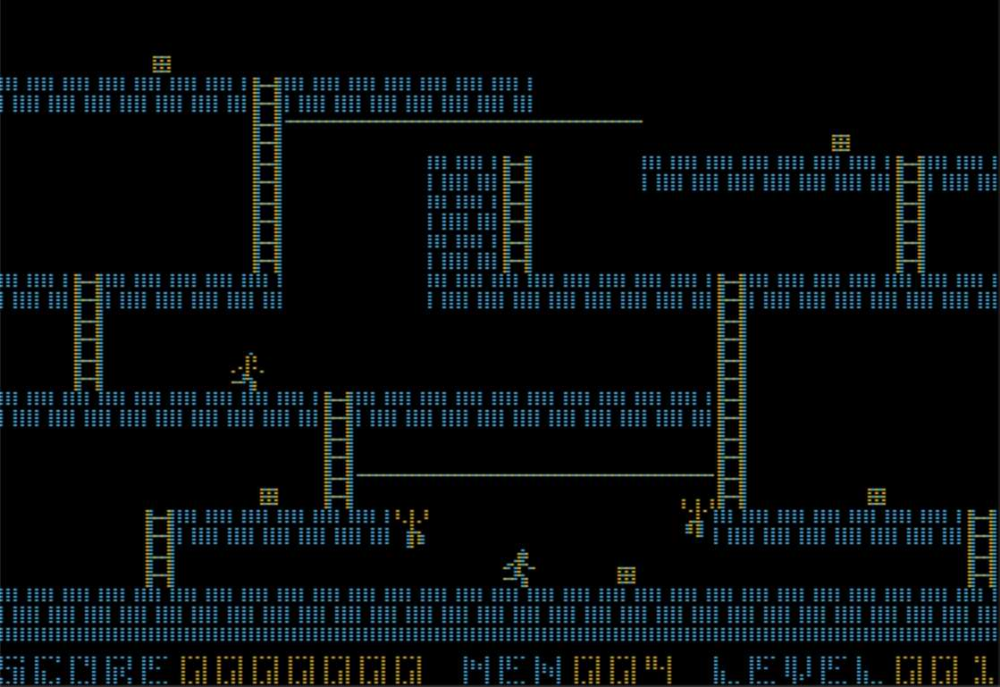
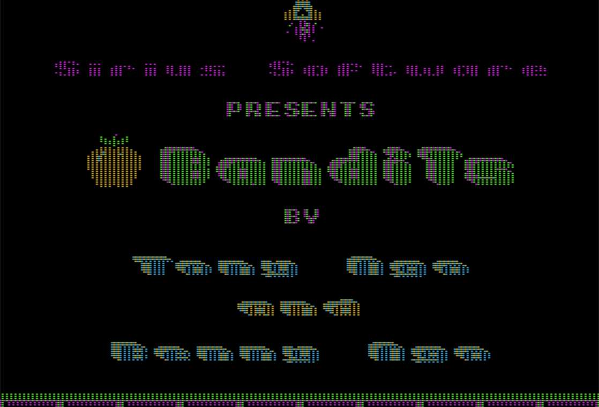
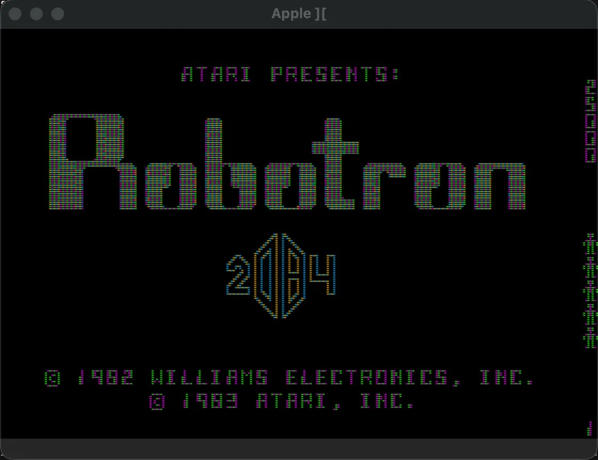
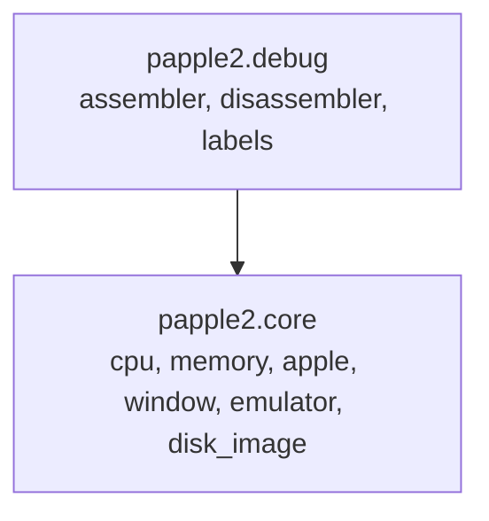
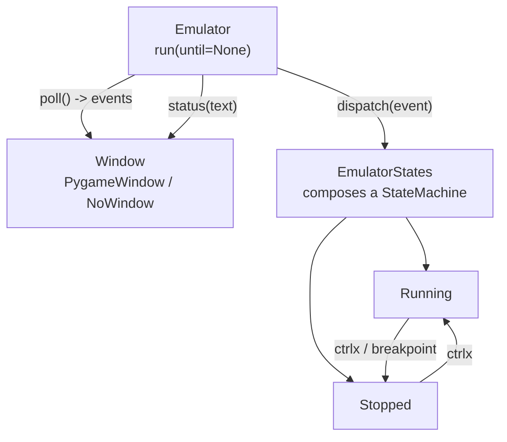
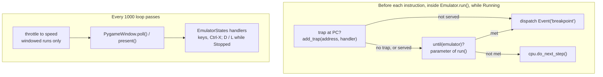
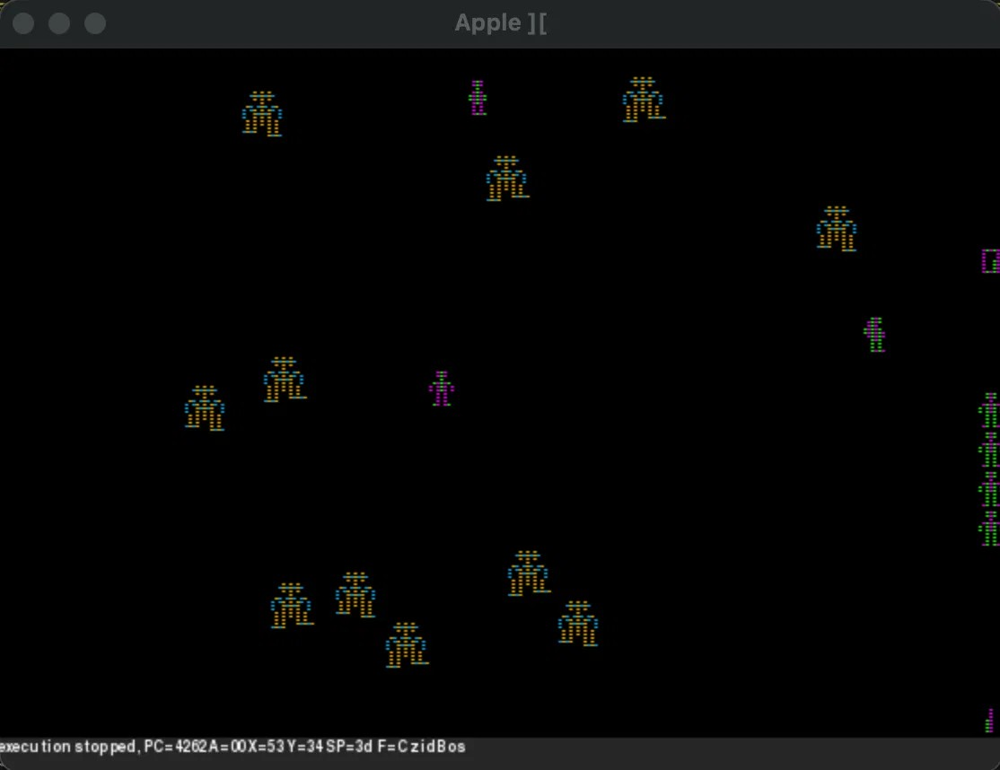
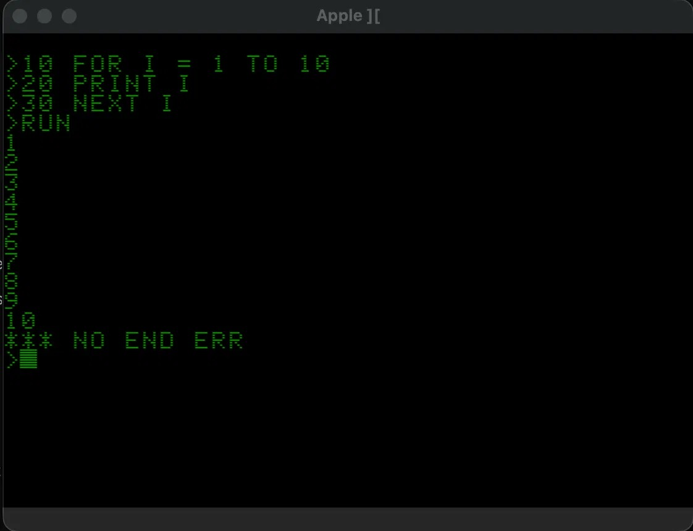

# papple2

**A small Apple II emulator written in Python, built as a debugging instrument rather than a player.**

---

## Contents

- [Vision](#vision)
- [The games](#the-games)
- [Architecture](#architecture)
  - [Package split](#package-split-m4-done-2026-09-12)
  - [Emulator / Window / States](#emulator--window--states)
  - [Extension points](#extension-points)
  - [Memory access by kind](#memory-access-by-kind)
  - [Speed](#speed)
- [Relation to sibling projects](#relation-to-sibling-projects)
- [Testing strategy](#testing-strategy)
- [Data files](#data-files)
- [Scripts & Experiments](#scripts--experiments)
- [Running](#running)
- [Settled decisions](#settled-decisions)

---

## Vision

`papple2` is a small Apple II emulator written in Python. It is not meant to compete with full emulators on speed or completeness. Its purpose is to be a debugging instrument: a machine I can stop, inspect, and script from Python while it runs Apple II code.

The core comes from ApplePy by James Tauber, ported to Python 3 and stripped of what I did not need (the socket interface). Around that core sit an assembler and disassembler, stand-ins for the disk routines two of the games call, and a speed control. The instruments that make it a debugging tool were rebuilt from scratch between 2026-09-27 and 2026-10-01, from the tag `pre-redesign` to the tag `core-complete`: memory access by kind with hook lists, `after_instruction`, and experiments that attach by method name. The decisions are in `docs/instrumentation-design.md`; the old design is drawn in `docs/instrumentation-map.md`. Next comes a workbench for reverse engineering on top of it, in IPython (`docs/workbench-ideas.md`), following `DIRECTION.md`: dynamic analysis first, static disassembly to fill the holes.

**Core philosophy:**

- **Understandability over speed.** Python is slow for emulation, but that never mattered for the debugging use. What mattered was that the whole emulator is a few thousand lines I can read, change, and extend in an afternoon, and that the debugging tools can be written in the same language as the emulator, with no bridge in between.
- **A debugging instrument, not a player.** The point isn't to run Apple II software well -- it's to run it *observably*: stoppable, inspectable, scriptable.
- **Runs with and without a screen.** The pygame window is for watching and interacting. Silent mode (`Emulator(no_display=True)`) is for tests and scripted analysis: boot, run to a point, press keys from code, read the buffers, done.
- **A second course in Python, this time on shape.** This project taught me Python the first time. This round it's teaching me how a Python project is shaped when it's meant to be reused: package layout, pytest, and separating a library from the programs that use it. `pysm` stays in the project for the same reason, even where a simpler mechanism would do -- state machines are part of what I want practice with.

---

## The games

Four programs boot in `papple2`: the Apple II's own Monitor and Integer BASIC, and three games that are among the best the Apple II has to offer. Only Lode Runner has been completely disassembled so far; the other two are the challenges ahead, with enough food for thought for countless hours.

**Lode Runner** (Doug Smith, Broderbund, 1983) is the worked example. XekriRedmane's literate-source disassembly, published at https://github.com/XekriRedmane/lode_runner_reveng, assembles byte for byte into the original, so it serves as the oracle: whatever `papple2` finds out by running the game is checked against it, and never fed into the tools. `papple2` plays real games from the original disk image, through a stand-in for the game's disk routine. All 150 levels, a celebration of Doug Smith's creativity, are on a single page: https://fschuhi.github.io/a2-lode-runner/levels.html.



*Lode Runner in a real game, played in `papple2`'s window from the original disk image (`make boot-lode-runner-throttled`).*

**Bandits** (Sirius Software, 1982, by the Ngo brothers) runs from Total Replay's ProDOS files, through a stand-in for ProDOS's MLI, from its cutscene into the game and on to Game Over. It has not been disassembled yet, and it is expected to be full of self-modifying code: the dream project in `DIRECTION.md`.



*Bandits' title screen with the bandits and their scores, from Total Replay's files (`make boot-bandits`).*

**Robotron 2084** (Atari, 1983) was `papple2`'s first test case, researched in 2019 and 2020: the public project https://github.com/fschuhi/Robotron_2084, and a thread on 6502.org. It has not been completely disassembled either.



*The Robotron 2084 splash screen, running through `make boot-robotron` -- `papple2`'s first test case.*

**More games:** Total Replay (by 4am and qkumba) ships many Apple II games as ProDOS files, loaded through the MLI, so the Bandits stand-in may serve many of them. Unchecked so far: how many need more MLI calls than Bandits, and how many need more than 48K (Total Replay itself targets 64K machines).

---

## Architecture

### Package split (M4, done 2026-09-12)

`papple2` is split into two layers:


```mermaid
graph TD
    DEBUG["papple2.debug<br/>assembler, disassembler, labels"]
    CORE["papple2.core<br/>cpu, memory, apple, window, emulator, disk_image"]

    DEBUG --> CORE
```

`papple2.core` never imports from `papple2.debug` (since 2026-09-27): the debugging tools use the machine, never the other way round. Programs that use `papple2` live outside both packages -- the boot scripts in `scripts/`, and the sibling projects below.

### Emulator / Window / States

This part is real and current, as of the M2.5 refactor (`HISTORY.md`, 2026-09-11). `Emulator.run` no longer touches pygame directly -- it polls a `Window`, dispatches whatever comes back to `EmulatorStates`, and lets `EmulatorStates` decide what that means:



```mermaid
graph TD
    E["Emulator<br/>run(until=None)"]
    W["Window<br/>PygameWindow / NoWindow"]
    S["EmulatorStates<br/>composes a StateMachine"]
    R["Running"]
    ST["Stopped"]

    E -- "poll() -> events" --> W
    E -- "dispatch(event)" --> S
    E -- "status(text)" --> W
    S --> R
    S --> ST
    R -- "ctrlx / breakpoint" --> ST
    ST -- "ctrlx" --> R
```

`PygameWindow` and `NoWindow` share the same three methods (`poll`, `present`, `status`), so `Emulator` doesn't know or care whether a window exists. An unserved trap, or an `until` condition passed to `run`, dispatches the same `breakpoint` event that `ctrlx` uses, so `Running` -> `Stopped` always goes through the state machine, never around it.

### Extension points

Since the redesign began (`HISTORY.md` 2026-09-27/28), `papple2` has four deliberately small ways to act on a running program. The old ones (checkpoints, CPU read/write hooks, the memory map) are drawn in `docs/instrumentation-map.md`, pinned to the tag `pre-redesign`; the ideas for what comes next are in `docs/instrumentation-ideas.md`, and the decisions taken so far in `docs/instrumentation-design.md`.

- **Hooks** (lists in `Memory` and `CPU`) watch every instruction and memory access, and experiments attach to them by method name; see "Memory access by kind" below.
- **Traps** (`add_trap(address, handler)`) stand in for a routine at a fixed address. Before each instruction, `run()` looks up `PC` in the trap table (only while there are any traps). A handler returns whether it *served* the address: `True`, and the run continues at whatever `PC` the handler set; `False`, and the run stops before the instruction there, via `breakpoint`. The two disk stand-ins, `RwtsHook` (Lode Runner, `$B7B5`) and `MliHook` (Bandits, `$BF00`), are traps.
- **`until`** is a parameter of `run()`, not an attachment point: a condition checked before each instruction (`instruction_count_reaches(n)`, `at_address(a)`). When it is met, `run()` stops via `breakpoint`; without a window it then returns, with a window it pauses as if Ctrl-X had been pressed. The ready-made conditions are in `papple2/debug/stop_conditions.py`.
- **Debug-key handlers** (`EmulatorStates.stopped_state`/`running_state`) are keyed to the window's events, not to instructions: `D` and `L` while Stopped. `tests/test_emulator_debug_keys.py` shows how to attach one from outside.


```mermaid
graph TD
    subgraph STEP["Before each instruction, inside Emulator.run(), while Running"]
        TRAP["trap at PC?<br/>add_trap(address, handler)"]
        UNTIL["until(emulator)?<br/>parameter of run()"]
        EXEC["cpu.do_next_step()"]
        BRK["dispatch Event('breakpoint')"]

        TRAP -- "no trap, or served" --> UNTIL
        TRAP -- "not served" --> BRK
        UNTIL -- "not met" --> EXEC
        UNTIL -- "met" --> BRK
    end

    subgraph PASSES["Every 1000 loop passes"]
        THR["throttle to speed<br/>windowed runs only"]
        WIN["PygameWindow.poll() / present()"]
        KEYS["EmulatorStates handlers<br/>keys, Ctrl-X; D / L while Stopped"]
        THR --> WIN --> KEYS
    end
```

### Memory access by kind

The CPU reads and writes memory through one `Memory` method per kind of access: `read_opcode`, `read_operand`, `read_pointer`, `read_data`, `read_immediate`, `read_stack` and `read_vector` for reads, `write_data` and `write_stack` for writes, plus three 16-bit reads built from them (`read_operand_word`, `read_pointer_word` with the 6502's page wrap, `read_vector_word`). The name says why the CPU accesses a byte, not where the byte is: `LDA $0100,X` touches the stack page, but it is a data read. Each method passes the access on to the shared `read_byte`/`write_byte`, where the soft switches and the display stay. Each method then calls the hooks in its own list (`after_read_opcode` ... `after_write_stack`); see `docs/instrumentation-design.md`, section 3.

`CPU` counts its instructions in `instruction_count` (zeroed like `cycles`, in `__init__` and `reset()`) and, at the end of each instruction, calls the hooks in `after_instruction`. These hooks get no arguments: they read `instruction_count`, `last_PC` and `last_opcode` from the `CPU`, so an experiment keeps the `CPU` it watches in `self.cpu`. See `docs/instrumentation-design.md`, section 4.

An experiment is a plain object whose methods are named after the hook lists. `Emulator.attach(experiment)` puts each such method into its list in `Memory` or `CPU`, and `detach(experiment)` takes them out again; both log one line at INFO. Two experiments use them: `scripts/lr_count.py` (a map of what Lode Runner's attract play runs, as opcode, operand or immediate) and `scripts/lr_tiles.py` (tiles split into disjoint basic blocks after the run, with their transitions).

### Speed

Unthrottled, `papple2` runs as fast as Python allows: about 3.5 times a real Apple II on an M4. Windowed runs take a `speed` (`Emulator(speed=...)`): 1.0 is a real Apple II (about 1.023 MHz), `None` is unthrottled, and 1.0 is the default. Every 1000 loop passes, `run()` compares the cycles the CPU has counted with the wall-clock time and sleeps the difference; after a pause it measures afresh. Headless runs and tests are never throttled. `scripts/boot_lode_runner.py` passes `None` unless it gets `--speed`, so `make boot-lode-runner` runs at full speed and `make boot-lode-runner-throttled` at the speed of a real Apple II. The display is shown 40 times per second (`frame_rate`).

---

## Relation to sibling projects

**`a2-lode-runner`:** a private educational project to understand the Apple II game thoroughly, based on XekriRedmane's literate-source disassembly project published at https://github.com/XekriRedmane/lode_runner_reveng. All 150 levels are extracted and shown on one page: https://fschuhi.github.io/a2-lode-runner/levels.html. The first target is the level loader (`LOAD_LEVEL`, chapter 6). `make dasm-listing` there turns XekriRedmane's source into a listing `papple2`'s workbench can grade against.

**`a2-hires-lab`:** a standalone Excel/VBA lab exploring Apple II hi-res graphics mechanics, built around Chapter 3 of the `a2-lode-runner` disassembly. No shared code or repo with `papple2`. Its NTSC color decision table, once fully verified by hand against the chapter's worked examples, is meant to become test fixtures for `papple2`'s `Display.update_hires`, which currently uses a simplified per-pixel color model with no neighbor-adjacency rules. That handoff hasn't happened yet.

**`probotron`:** my private project with the Robotron 2084 disassembly and its Excel/PyXLL workbench, carved out of `papple2` in M7.5. Since 2026-09-27 it holds its own copy of `papple2` (the state at the tag `pre-redesign`), so it no longer depends on this repo. Its predecessor from 2019/2020 is public: https://github.com/fschuhi/Robotron_2084. `scripts/boot_robotron.py` remains here as `papple2`'s own manual check of the with-window path.

---

## Testing strategy

`papple2` is verified at two tiers, deliberately:

- **Automated (`make test`).** The pytest suite covers 6502 instruction semantics and the classic hardware quirks, Apple II specifics (soft switches, the hi-res memory buffer, the disk image), running headless with traps and `until`, the state machine, the throttle's calculation, and the assembler and disassembler. All of it runs with `no_display=True` -- no pygame window involved, and none of it can be, meaningfully: a headless run has no way to assert "does this look right on screen."
- **Manual, with-window (`make boot-robotron`).** Runs `scripts/boot_robotron.py`, a plain script that boots `Emulator(no_display=False)` with the real `ROBOTRON.BIN` and calls `run()` with no `until` -- the same path the old in-repo Robotron showcase exercised, but with zero dependency on `probotron`'s workbench or Excel bridge.
- **Manual, with-window, text mode (`make boot-basic`).** Runs `scripts/boot_basic.py`. Boots the Monitor and, on `Ctrl-B`, Integer BASIC -- the same real ROM path as `make boot-robotron`, but through the text page instead of hires. Catches display and keyboard bugs specific to `Display.update_text()` that a hires-only Robotron run never would.
- **Manual, with-window, games (`make boot-lode-runner`, `make boot-lode-runner-throttled`, `make boot-bandits`).** Lode Runner's attract mode, then a real game on a key press, at full speed or at the speed of a real Apple II; Bandits from its cutscene into the game. Both reach their games through the disk stand-ins, so these runs check the traps as well.

The manual checks are plain scripts in `scripts/`, not pytest tests: they assert nothing, and the point is a human watching the window. So `make test` never opens a window, and each script runs via its own `make` target.



*Execution stopped mid-game via `Ctrl-X` -- the status bar shows the halted CPU state, the same inspect point `Emulator.run(until=...)` and unserved traps stop at.*

---

## Data files

`papple2` needs three Apple II binaries, one disk image and Bandits' files from Total Replay, none of which can be distributed in this repo -- all of them are still under copyright. `data_dir` in `papple2.toml` points to `data/`; its folders `data/bin/` (binaries), `data/do/` (disk images) and `data/tr/bandits/` (Total Replay files) ship with a `.gitkeep` and nothing else. Get the files yourself:

- **`A2ROM.BIN`** -- the Apple II ROM. Available from [Reactive Micro's downloads](https://downloads.reactivemicro.com/Users/Grant_Stockley/), Grant Stockley's page -- also a good source of hard-to-find Apple II documentation and software generally, worth knowing about on its own.
- **`ROBOTRON.BIN`** -- a raw memory image of Robotron 2084. Not distributed as a standalone binary anywhere; has to be produced from the original DOS 3.3 disk image:
  1. Download `Robotron 2084 (1983)(Atari).do` from [myabandonware](https://www.myabandonware.com/game/robotron-2084-2t#download).
  2. Open it in [CiderPress II](https://github.com/fadden/CiderPress2), an open-source Apple II disk/file archive tool.
  3. Right-click on the `ROBOTRON` entry (Type `B`, binary) and extract it.
  4. Check the extracted file's size: 25088 bytes, matching the Data Len CiderPress II shows for the entry, and `ROBOTRON.BIN`'s expected size. If it doesn't match, something went wrong in the extraction.
- **`LODE_RUNNER.BIN`** -- the main program of Lode Runner (Broderbund, 1983), for `make boot-lode-runner`. Also produced from a disk image:
  1. Download the disk image from [archive.org](https://archive.org/details/a2_Lode_Runner_1983_Broderbund_cr_Reset_Vector) (the release cracked by Reset Vector).
  2. Open it in CiderPress II.
  3. Right-click on the `LODE RUNNER` entry (Type `B`, binary) and extract it. Its auxiliary type is `$0800`, the address DOS loads it to, which is also where `scripts/boot_lode_runner.py` loads it.
  4. Check the extracted file's size: 33024 bytes, matching the Data Len CiderPress II shows for the entry. Rename it to `LODE_RUNNER.BIN`.
- **`Lode_Runner_1983_Broderbund_cr_Reset_Vector.do`** -- the Lode Runner disk image itself, the same archive.org download as in step 1 above. Keep its name. `make boot-lode-runner` reads the levels and the high-score table from it once a real game starts. Its size must be 143360 bytes (35 tracks, 16 sectors of 256 bytes, DOS 3.3 order); `papple2.core.disk_image` refuses anything else.
- **Bandits' files** -- the main program `BANDITS` and its data files `BANDITS.A` to `BANDITS.Z`, from Total Replay v6.1 (by 4am and qkumba), for `make boot-bandits`:
  1. Get the Total Replay v6.1 disk image.
  2. Open it in CiderPress II.
  3. Extract `BANDITS` (Type `BIN`, loads at `$0800`, 9479 bytes) and the data files `BANDITS.A` to `BANDITS.Z` (Type `NON`), keeping their names.

Place the three binaries in `data/bin/`, the disk image in `data/do/`, and Bandits' files in `data/tr/bandits/` (all below wherever `data_dir` in your `papple2.toml` points).

---

## Scripts & Experiments

The tools interacting with `papple2` live in the `scripts/` folder and generally fall into two categories:

- **The `boot_*` scripts:** Manual, visual checks that boot the emulator with a specific game or ROM payload attached to the pygame window. These are test-bed wrappers used for visual verification (`boot_basic.py`, `boot_robotron.py`, `boot_lode_runner.py`, `boot_bandits.py`).
- **The `lr_*` experiments:** Headless analysis routines currently focused on Lode Runner's attract play. These attach custom instrumentations (like tracing and block-mapping hooks) to analyze how the game executes. 
  - `lr_count.py`: a 256x256 map of the memory, one cell per address, showing which addresses ran as opcode, operand or immediate (PNG and HTML).
  - `lr_trace_pc.py`: Tracks and records a direct trace of execution flow.
  - `lr_tiles.py`: collects tiles (runs of instructions from a leap target to the next leap) and the transitions between them; after the run, splits overlapping tiles into disjoint basic blocks and checks that every execution is accounted for (CSV, plus measurements as text).

---

## Running

```bash
make setup    # create the venv (Python 3.12), install dependencies in editable mode
make test     # run the pytest suite
make boot-robotron  # boot Robotron with the pygame window open
make boot-basic     # boot Apple II into the Monitor; Ctrl-B enters Integer BASIC
make boot-lode-runner           # boot Lode Runner with the pygame window open; a key press starts a real game from the disk image
make boot-lode-runner-throttled # the same, at the speed of a real Apple II
make boot-lode-runner-headless  # run Lode Runner headless; save both hi-res pages as PNG
make boot-bandits               # boot Bandits from Total Replay's ProDOS files
make lr-count        # Experiment: map which addresses Lode Runner's attract play runs (PNG and HTML)
make lr-tiles        # Experiment: collect tiles and transitions, plus measurements (CSV and text)
make lr-trace-pc     # Experiment: record start PC, opcode and end PC of every instruction (CSV)
```

`make setup` will happily produce a broken install if your default `python3` resolves to 3.14. If needed: `rm -rf .venv && python3.12 -m venv .venv && make setup`.



*`make boot-basic`, then `Ctrl-B` into Integer BASIC, running a small hand-typed program -- the real ROM, not a simulation of it.*

---

## Settled decisions

This section is more useful to an LLM picking this project back up than to me -- which is exactly why it's here: `README.md` rides along in every session's `filesdump.txt` by default.

- **`papple2` is a real, installable Python package** (`src/papple2/`, `pyproject.toml`, editable install via `make setup`), split into `papple2.core` and `papple2.debug` sub-packages (M4, 2026-09-12). Internal imports are explicit (`from papple2.core.X import Y` / `from papple2.debug.X import Y`) -- star-imports were replaced project-wide back on 2026-09-06, earlier than this file previously said.
- **Python 3.12 for the venv, not whatever `python3` resolves to.** `pygame` 2.6.1 doesn't build or run correctly under Python 3.14 as of this writing (open upstream issue).
- **Paths come from `papple2.toml`** (local, gitignored; `papple2.example.toml` committed), not hardcoded Windows strings, and not `os.chdir`.
- **`EmulatorStates` composes a `StateMachine` rather than subclassing one.** It's the root of its own state tree and is never handed to code that expects a plain `StateMachine` -- the case for composition over inheritance. The individual states (`EmulatorRunningState`, `EmulatorStoppedState`) do legitimately subclass `StateMachine`, since they're genuinely registered as states via `add_state`.
- **`L` and `D` are reserved for debug hooks, and only while execution is `Stopped`.** `PygameWindow.poll()` turns those two keys into `Event('l')`/`Event('d')` instead of ordinary keystrokes -- but only in the `Stopped` state; while `Running`, they pass through like any other key, so typing them into the Monitor or BASIC works normally. `D`'s built-in use is `EmulatorStoppedState.on_d`, a generic CPU-register dump -- genuinely core behavior, not Robotron-specific. `L` has no built-in behavior at all; it's a bare hook slot, meaningful only once something external attaches to it (see `tests/test_emulator_debug_keys.py`).
- **`Display.update_text()` only draws a glyph in full `text` mode, or in `mix` mode on rows 20-23.** Outside those cases (plain hires/lores, `mix` off) a text-page write must stay invisible, matching real hardware, where the text page isn't scanned out at all in that mode. Had this backwards for a long time (`not self.mix` instead of `self.mix and row >= 20`) -- harmless while `update_text()` itself was commented out, but corrupts hires output the moment it's turned on.
- **The window (pygame) is a separate, swappable layer, not baked into `Emulator`.** `PygameWindow`/`NoWindow` share `poll() -> list`, `present()`, `status(text)`; `Emulator.__init__` picks one based on `no_display`. `Emulator.run` and the state handlers contain no pygame reference.
- **An unserved trap or a met `until` condition dispatches `Event('breakpoint')` into the state machine, rather than hard-returning out of `run`.** Separately, a headless `run(until=...)` returns to its caller once execution stops for any reason, while with a window a met `until` only pauses, and Ctrl-X continues; a plain `run()` call (no `until`) keeps looping through pauses as before, and only stops on `halt`. Without a window, an unserved trap ends the run, since nothing could resume it.
- **`time.monotonic()`, not `pygame.time.get_ticks()`, for frame pacing** -- works identically whether or not a window exists.
- **`QUIT` (closing the window) and the Print key both map to the same `halt` event.** There's no separate hard-exit path. Print exists mainly for the Windows heritage of this code; on macOS, closing the window is the primary way to trigger it.
- **An unserved trap stays in the table after it fires.** Its handler left `PC` at the trap's address, so if something resumes via `ctrlx` within the same `run()` call, the trap is called again at once and stops again, unless what it depends on has changed. `until` is checked afresh in every `run()` call.
- **`papple2.core` never imports from `papple2.debug`** (since 2026-09-27). The debugging tools use the machine, never the other way round.
- **State changes go through events, and `executing` mirrors the state machine.** Only `Running`'s entry and exit actions set `executing`, and `initialize(fire_events_on_init=True)` runs the entry action at construction, as Harel's statecharts demand (`test_executing_follows_the_state_from_the_start`).
- **A trap returns *served*, a single `bool`.** `True`: continue at the `PC` the handler set. `False`: stop before the instruction at the trap's address. The table is looked up only while it holds any traps -- the dictionary's own truthiness, no separate flag to keep in sync.
- **The throttle compares emulated cycles with wall-clock time, in windowed runs only** (`throttle_delay()`, tested without sleeping). It can only slow down a run that is too fast.
- **The disassembler is static**, with an optional `is_code(address)` (default: every address is code); addresses that aren't code come out as `.byte` blocks. It reads the memory list directly.
- **The CPU accesses memory only through the kind methods** (since 2026-09-29), and a 16-bit read is two byte reads of the same kind.
- **Immediate operands are a kind of their own** (since 2026-10-01): `read_immediate`, chosen by the CPU's `immediate` flag, which `immediate_mode()` sets and `do_next_step()` resets, so it lives only within one instruction. Not split operations: the flag is the smaller, more readable change.
- **Whatever only looks reads the memory list directly** -- the disassembler, and later monitors and reports -- past the devices and past anything that watches the CPU.
- **No save states for now.** Pickling was removed on 2026-09-29; snapshots will be designed fresh when an experiment needs them.
- **`after_instruction` hooks take no arguments** (since 2026-09-29). They read what they need from the `CPU`'s fields; `reset()` keeps them. `CPU.instruction_count` is not `Emulator.instructions`: the first counts since a fresh start, the second since the current `run()` call.
- **Every test module is plain `pytest`** (since 2026-09-29): functions and fixtures, no `unittest` classes.
- **Experiments attach by method name** (since 2026-09-29): `Emulator.attach()` matches methods to the hook lists by name, refuses a method starting with `after_` that matches no list, and logs through Python's `logging`. No base class and no named hook types for experiments: an experiment exposes whichever hooks it needs.
