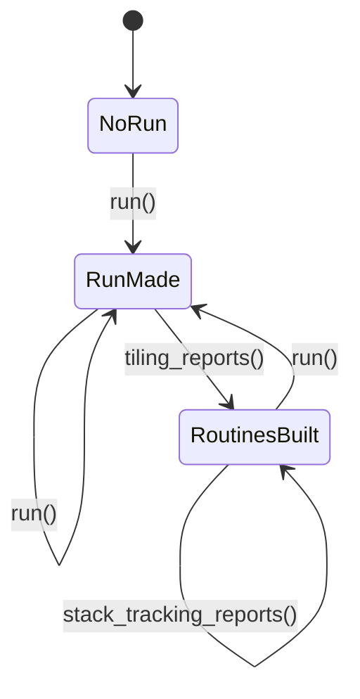

# REFACTORING: `shell.py` to `Session`

Status: third draft of 2026-10-10. The three open questions of the second draft are answered (section 10). Nothing is approved for implementation yet.

## 1. Goal

`shell.py` keeps the whole state of a working session in module variables, changed by `global` statements in several functions. A reader cannot see which command needs which state, or in which order the state gets filled. The refactoring gives that state one owner: a `Session` object.

- **No change in functionality.** Every command keeps its name, its arguments and its output. The tests keep their assertions.
- The refactoring reverses one decision in `docs/decisions.md` ("Commands, not classes ... No `Workbench` class"). The reason: the state is now too large to follow as module variables. The commands stay the contract; only where they keep their state changes.
- The next refactoring starts from the new structure and is as compact as possible. This one only makes that possible.

## 2. Names

| Name | Persistent? | What it is | Where it lives |
|---|---|---|---|
| `Workbench` | yes | the environment above the dossiers, with settings of its own | not built; the name stays free for later |
| Dossier | yes, under git | everything known about one program | `dossiers/<program>/` |
| `Session` | no | the open dossier, the reports folder and the current run | module variables of `shell.py` today, `Session` after this refactoring |

Word rule for the documents: `Session` in code font is the object. "Session" in plain text, as in the "Current Session Pointer" of `GOALS.md`, is a working session between us.

## 3. What `shell.py` holds today

Four kinds of things, mixed in one module. Which kind a thing is decides where it goes.

| Kind | What it is | Names (examples) |
|---|---|---|
| A. State | module variables | `reports_folder`, `dossier_folder`, `annotations`, `hidden`, `color_store`, `run_program`, `run_emulator`, `run_rwts`, `run_instrumentations`, `routines`, `run_graph`, `run_transitions`, `run_stack_jumps`, `editor_views` |
| B. Logic that uses state | reads or changes A | `write_report`, `current_annotations`, `refresh_annotations`, `address_of`, `current_hidden`, `current_colors`, `label_routines`, `current_routines`, `routine_at`, `call_sites`, `caller_items`, `listing_range`, `current_listing_rows`, `routine_place`, `save_edit`, and the bodies of `run`, `tiling_reports`, `stack_tracking_reports`, `set_current_run` |
| C. Logic that uses no state | gets everything as arguments | `listing_rows`, `ran_parts`, `never_ran`, `ran_in`, `scope_of`, `shorten_locals`, `arrows_in`, `assign_lanes`, `draw_gutter`, `hexdump_rows`, `apple_char`, `print_*`, `routine_graph`, `loop_ids`, `innermost_loop`, `Text`, `returns_text` |
| D. Commands | what the user types at the prompt | `use_dossier`, `label`, `hide`, `color`, `run`, `listing`, `edit`, `hexdump`, `show_*`, `clip`, ... |

Kind C needs no `Session`: a method would add nothing. Kind D stays in `shell.py` as thin wrappers.

## 4. The state, and when it exists

Two independent groups, plus the editor's memory.

| After this command | This exists | Error if it is missing |
|---|---|---|
| `use_reports_folder()` | the reports folder | no reports folder set |
| `use_dossier()` | annotations, hidden ranges, colors | no dossier open |
| `run()` | the machine, its instrumentations, the RWTS stand-in; routines of an earlier run are forgotten | no run |
| `tiling_reports()` or `set_current_run()` | routines, run graph, run transitions; the editor's memory is cleared | no routines |
| `stack_tracking_reports()`, after `tiling_reports()` | stack jumps; routines are built again, now with the targets of the stack jumps | no StackTracking attached |

The reports folder and the dossier are independent of this: they can be set at any time, before or after a run. The `Session` keeps all three groups, but as separate sections, so a reader sees which commands belong to which.

Noticed, not changed: `set_current_run()` leaves `run_program` and `run_instrumentations` as they were. It matters only when a run is set from reports made elsewhere.

## 5. Target

**`src/papple2/workbench/session.py`**: the class `Session`.
- It owns the state of kind A, as attributes, all empty at construction, as the module variables are empty at import today. Each instance has its own `run_instrumentations` list.
- It is a plain class: ordinary attributes, no `__slots__`, no properties for the state, no type checks. The tests assign stand-ins to its attributes (a `SimpleNamespace` as `annotations`, a bare namespace as `run_emulator`), and that must keep working.
- The attributes keep today's names, `run_` prefix included. Renaming them multiplies the diff in the tests; it is a later step.
- It has the logic of kind B as methods, named like the commands they serve (`use_dossier`, `run`, `tiling_reports`, ...).
- Methods that take an address take `int | str`, as the commands do, and resolve a label themselves, since only the `Session` knows the dossier.
- It does not print and does not return `Text`.

**`src/papple2/workbench/shell.py`**: the commands.
- One instance, `session = Session()`, at module level. Every command looks it up at call time, so a test can replace it.
- Each command calls the instance and shapes the result for IPython (`Text`, `print`, the clipboard).
- The commands keep their full docstrings, since those are the help at the prompt. A method gets a one-line docstring.
- `label()`, `hide()`, `color()` and the other dossier commands stay in `shell.py` in step 1 and use `session.current_annotations()` and friends.
- Kind C stays in `shell.py` during step 1.
- `editor_views` is cleared in place, as today.

**Several kinds of session.** The `Session` is not tied to Lode Runner. In step 1 it takes the program setup in `run()`, as `run()` does today. An experiment that needs a different machine (e.g. no RWTS stand-in) is a different program setup, a change in `papple2.programs`, not in this refactoring. An experiment may own a `Session` of its own, and `shell.py` holds another one.

**What the reader gains**
- One place to look for any state: `shell.session.routines`, `shell.session.annotations`, ...
- `from papple2.workbench.shell import *` no longer copies stale values: it copies a reference to the one `Session`, which stays current.
- Tests make a fresh `Session` instead of patching eight module variables.

## 6. Steps

Before the first slice: a git tag on the current state, e.g. `pre-session`, as `pre-redesign` was one. It is the rollback point for the whole refactoring.

Each slice is one delivery, tests green after each, and each is committed before the next begins.

**Delivery as patches** (decision 1 of section 10), following `LLM_INSTRUCTIONS.md`, "Patches for `make patch`":
- One patch per slice, `2026-MM-DD-<topic>.patch`, covering all changed existing files of the slice, checked with `git apply --check` against the exact current files, with the base commit named.
- The base commit comes from you at the start of the next session. The base of slice 1b is the commit after slice 1a was applied and committed, so `session.py` is an existing file by then.
- New files (`session.py` in slice 1a) come as complete files next to the patch.
- `manifest.lst` appears in no patch. A new file that should be in the dump gets one line from me ("`session.py` would need an entry"), and you do it.
- If I can not check a patch against the exact file, I fall back to a complete file for that file and say so (Rule 2).

### Step 1: state and pipeline (shallow)

- **1a, the dossier and the reports folder.**
  - `Session` gets `reports_folder`, `dossier_folder`, `annotations`, `hidden`, `color_store`, and the methods `use_reports_folder`, `write_report`, `use_dossier`, `current_annotations`, `refresh_annotations`, `address_of`, `current_hidden`, `current_colors`.
  - The module variables go. Every read of them in `shell.py` becomes `session.<name>`.
  - `write_report()` and `use_reports_folder()` stay importable from `shell` (`lr_overview.py` uses them).
  - The run variables are still module variables in this slice.
  - Changed: `session.py` (new), `shell.py`, `tests/conftest.py`, and the six test files of section 7.
- **1b, the run.**
  - `Session` gets `run_program`, `run_emulator`, `run_rwts`, `run_instrumentations`, `routines`, `run_graph`, `run_transitions`, `run_stack_jumps`, `editor_views`, and the methods `run`, `tiling_reports`, `stack_tracking_reports`, `set_current_run`, `label_routines`, `current_routines`, `routine_at`.
  - Again the module variables go, and every read in `shell.py` changes in the same slice.
  - Changed: `session.py`, `shell.py`, `tests/conftest.py`, the test files of section 7, and the docstring of `scripts/lr_basic_blocks_analysis.py`.
- Kind B functions that only read (`call_sites`, `current_listing_rows`, `routine_place`, ...) stay in `shell.py` in step 1 and read `session.*`. A plain substitution; no logic moves.
- `current_listing_rows` must stay a module function of `shell`, and `listing()` must call it by its module name: `test_listing_colors.py` replaces it there.

### Step 2: later, decided when we get there

- **2a.** Kind B functions that only read become `Session` methods, so the commands are thin. `test_listing_colors.py` then patches `shell.session.current_listing_rows` instead.
- **2b.** Kind C moves out into modules of their own (probably listing, hexdump, routine graph, text).
  - `shell.py` re-exports what scripts and tests import: `walkthrough.py`, `test_walkthrough.py` and `lr_overview.py` take functions from `shell`.
  - `test_hidden_listing.py` uses `shell.Disassembler` in a function annotation, which Python evaluates when the test module is imported. So `shell` must still have that name, or the test changes.

Whether 2a and 2b are one step or two is open.

## 7. Tests

- **One new fixture** `fresh_session` in `tests/conftest.py`: `monkeypatch.setattr(shell, "session", Session())`.
- **The old fixtures keep their names.** `no_run`, `no_dossier` and `no_reports_folder` (and the local `no_dossier` in two test files) request `fresh_session` and do nothing else. Reason: pytest builds a fixture once per test, so a test that asks for two of them shares one fresh `Session`. Fixtures that each replaced the session on their own could throw away state an earlier one had set.
- Where a test reads or sets internals, it changes to `shell.session.<name>`. Assertions do not change. If one must, we stop and discuss (Rule 5).

| Test file | What changes | Slice |
|---|---|---|
| `test_shell.py` | fixtures for reports folder and dossier; the eight run variables in `no_run`; reads of `shell.routines`, `shell.run_transitions`, `shell.run_instrumentations`, `shell.run_emulator`, `shell.run_stack_jumps`; the `hexdump_run` fixture | 1a and 1b |
| `test_shell_hidden.py` | the `no_dossier` fixture, reads of `shell.hidden`, `shell.run_emulator` and `shell.routines` in one test | 1a and 1b |
| `test_shell_colors.py` | the `no_dossier` fixture, reads of `shell.color_store`, `shell.routines` in three tests | 1a and 1b |
| `test_listing_colors.py` | `dossier_folder` and `color_store` in `colored_listing`, and in one test; should also request `fresh_session` | 1a |
| `test_hidden_listing.py` | the `current_listing` fixture: `dossier_folder`, `annotations`, `hidden`, then `run_emulator`, `run_graph`, `routines` | 1a and 1b |
| `test_breadcrumbs_colors.py` | `annotations` and `color_store`, then `routines` | 1a and 1b |
| `test_walkthrough.py`, `tests/conftest.py` fixtures `walkthrough` etc. | nothing in step 1 (conftest gets the new fixture) | none, 2b for imports |

## 8. Documents to update when step 1 is done

- `docs/decisions.md`: replace "Commands, not classes" by the new decision, with its reason; add `Session`, `Workbench` and the word rule of section 2.
- `docs/workbench.md`: the "Machinery" row (`shell.run_emulator`, ... becomes `shell.session.<name>`), the overview of `shell.py`, and the glossary (`Session`, `Workbench`).
- `README.md`: the "Workbench" section.
- `scripts/lr_basic_blocks_analysis.py`: its docstring names `shell.run_emulator`, `shell.routines` and others.
- `GOALS.md`: the Current Session Pointer. `TODO.md`: remove the "No `Workbench` class is approved" sentence, strike the `__all__` item for stale copies, add what is left for step 2.
- `HISTORY.md`: one dated entry.

## 9. Not in this refactoring

- No new commands, no changed output, no changed file formats.
- No `Dossier` class: the dossier stays three stores owned by the `Session`.
- No change to `tiling.py`, `stack_tracking.py`, `basic_blocks_analysis.py` or the listing editor.
- No new program setups.

Directions noticed, to be taken up after this refactoring:
- **Analysis on plain data types.** `basic_blocks_analysis.py` works on `SplitTile`, `SplitTransition` and `ReturnRow`; the CSV files only turn files into those. A later `TilingManager` held by the `Session` could hand over the same types from memory, with the files as one output. The rule "analysis works on reports" would then become "analysis works on plain data types". It needs a test that both paths give the same result.
- **Names for what instrumentations write.** Tiles, transitions and returns are not reports: they are recordings of one run, as counts. The loop CSVs and `lr_overview.txt` are reports. The new word is open; my suggestion is `profile`, and "trace" stays free for something with an order (e.g. a future `lr_frames.csv`).
- **The `Workbench`** as a persistent object above the dossiers, with settings of its own. Not decided, low urgency.
- **A `pysm` state machine** for the state of section 4, much later. A computed `state` property would come first.

## 10. Decisions taken

1. **Delivery:** patches for `make patch`, as in section 6. The base commit is given at the start of the next session.
2. **Attribute names:** kept, `run_` prefix included.
3. **Step 1:** two slices, 1a and 1b.

## 11. The next session

What it needs from you in the first message:
- the base commit (and that the tag `pre-session` is set);
- `CRITICAL_RULES.md`, `FIRST_PROMPT.md`, and a fresh dump.

What the dump needs, by name (the entries are yours, Rule 9):
- **In:** `shell.py`, `listing_editor.py`, `annotations.py`, `hidden.py`, `colors.py`, `stack_tracking.py`, `basic_blocks_analysis.py`; `tiling.py` (only its names and constants are used, but it is where `Tiling` lives); `programs/lode_runner.py`; `core/emulator.py`; the tests `conftest.py`, `test_shell.py`, `test_shell_hidden.py`, `test_shell_colors.py`, `test_listing_colors.py`, `test_hidden_listing.py`, `test_breadcrumbs_colors.py`, `test_walkthrough.py`; the scripts `lr_basic_blocks_analysis.py`, `lr_overview.py`, `walkthrough.py`; this file, `docs/decisions.md`, `docs/workbench.md`, `README.md`, `GOALS.md`, `TODO.md`, `Makefile`.
- **Out:** the big `lr_split_*.csv` reports, `core/apple.py`, `core/cpu.py`, `core/memory.py`, `core/window.py`, `core/disk_image.py`, `debug/*`, `scripts/boot_*.py`, `scripts/lr_count.py`, `scripts/lr_tiles.py`, `docs/instrumentation-design.md`, `docs/editor-ideas.md`.
- `session.py` is new, so it is not in the first dump. It gets an entry after slice 1a.
