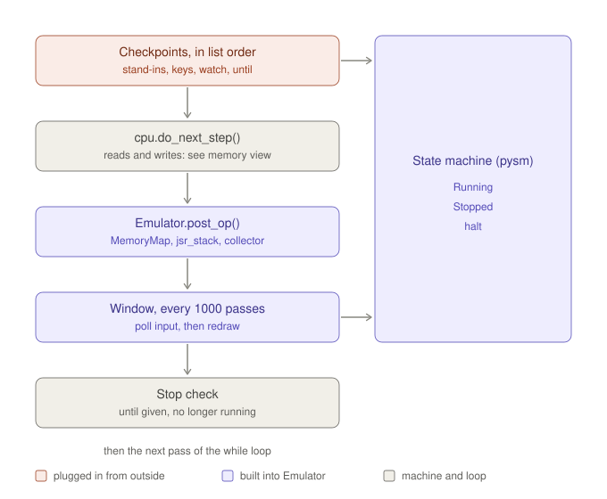
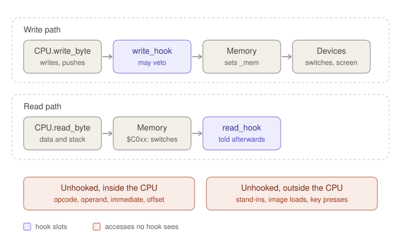

# Map of the instrumentation at `pre-redesign`

**Status:** describes `papple2`'s code at the git tag `pre-redesign` (commit `0797250`), drawn 2026-09-27. Evidence for the redesign, not a design.

"Instrumentation" here covers everything that watches or steers execution: checkpoints, breakpoints, hooks, the state machine, and what runs after the run.

---

## 1. One pass of the run loop



- The checkpoints and the CPU step run only while the state machine is in Running. In Stopped, the loop keeps turning so the window can still be polled; otherwise Ctrl-X could never resume.
- A checkpoint returning `execute=False` sends `breakpoint` (Running to Stopped). Headless, it ends the loop instead, because no keyboard could ever resume it.
- The window sends: Ctrl-X toggles Running and Stopped; a key press goes through the Running state's handler to `press_key()`; D and L only while Stopped; closing the window sends `halt`.
- `post_op()`, in order: `MemoryMap.post_op()` creates or updates the `OpInfo` and links it to the previous instruction; the leap handlers process branches, `JMP`, `JSR` (push onto `jsr_stack`) and `RTS` (pop, if it matches); `prev_info` is set; if the collector's hooks are on, it stores what it gathered during the step.

## 2. One memory access



- A write asks `write_hook` first; a falsy return drops the write. A read goes to `Memory` first and tells `read_hook` afterwards.
- Each hook slot holds exactly one function. `CPUHook.enable_*()` remembers whatever was installed before and passes every call on to it, building a chain by hand.
- Pointer reads in the indirect modes (`(zp),Y`, `(zp,X)`, `JMP (abs)`) go through `read_word_bug()`: `Memory` reads two bytes, but `read_hook` hears about them once, with a 16-bit value.
- `MemAccessCollector` keeps only the last write per instruction, so the first of a `JSR`'s two pushes is lost. It guesses indirect accesses by counting reads: an `RTS`'s two stack reads look like "pointer, then data" in `mem_access_log()`, and an `RTI`'s three reads would trip its `assert`.
- Devices sit inside `Memory`: reading `$C000` returns the key latch, `$C010` clears the strobe, `$C050`-`$C057` switch display modes, a write to `$C0xx` counts as a read, and writes to the text and hi-res pages redraw the screen.

## 3. Attachment points

| Attachment point | When | Who uses it | Boots need it? |
|---|---|---|---|
| Checkpoint list | before each instruction | `RwtsHook` (Lode Runner), `MliHook` (Bandits), `watch` (Lode Runner headless), `until` from `run()`, `KeyScript` (tests). Unused: `RecordedKeys`, `PrintCharTester`, `RandomTesterCheckpoint` | yes |
| CPU hook slots | during the instruction | `MemAccessCollector` (only with `mem_access=True`), `WriteProtectHook` (test). `Emulator.write_hook` exists but is never installed | no |
| `post_op()` | after each instruction, always | `MemoryMap`, `jsr_stack`, the collector's store step. Bandits catches `MemoryMap`'s assertion to report it | no |
| Window and state machine | every 1000 passes | keys, Ctrl-X, D, L (attached by a test), `halt`; `breakpoint` from checkpoints | yes, windowed |
| After the run | once, offline | `TileFactory`, stretches, `DotCallTree` (read `MemoryMap`); collector tables; the scripts' own logs | no |

`boot-basic` and `boot-robotron` attach nothing. In the window row, keys and redraw are the machine's input and output; Ctrl-X pausing and the D and L keys are instrumentation.

## 4. The inner loop, per instruction

Every addressing mode takes its own path through `cpu.py`. The interactive version shows seven instructions (`LDA #$05`, `LDA $1234`, `STA ($06),Y`, `INC $1234`, `JSR $6000`, `RTS`, `BNE`): open [`diagrams/inner-loop.html`](diagrams/inner-loop.html) in a browser.

One of them as text. Indentation shows who calls whom; `[no hook]` marks accesses `read_hook` and `write_hook` never see.

```text
STA ($06),Y  (opcode $91)
Checkpoints  checkpoints run, in list order (may change PC, SP, memory)
Emulator     cpu.do_next_step()
  CPU          cycles += 2; reset immediate, branched, operand_length; last_PC = PC
  CPU          read_pc_byte(): read_byte(PC, hook=False), PC += 1       [no hook]
    Memory       read_byte(PC) -> opcode $91
  CPU          ops_dispatch[$91]() -> STA(indirect_y_mode(rmw=True))
  CPU          indirect_y_mode(): operand_length = 1, cycles += 4
  CPU          read_pc_byte(): zero-page address, PC += 1               [no hook]
    Memory       read_byte(PC) -> $06
  CPU          read_word_bug($06)
    Memory       read_word_bug($06): read_byte($06), read_byte($07) -> pointer
    Hooks        read_hook($06, pointer): once, with a 16-bit value
  CPU          address = pointer + Y
  CPU          STA(address): write_byte(address, A)
    Hooks        write_hook(address, A): a falsy return drops the write
    Memory       write_byte(address, A): _mem[address] = A
      Devices      screen page: Display.update; $C0xx: soft switch
Emulator     post_op(): reads last_PC, operand_length, cycles
  Emulator     MemoryMap.post_op(): OpInfo (opcode from _mem, first sight only), byte types, link to previous
  Emulator     prev_info = info; collector stores its reads and last write (if hooked)
Emulator     instructions += 1
```

## 5. What the maps show

- Instrumentation hangs at five points, each with its own timing, its own return convention and its own blind spots. There is no common event the five share, so how they interact depends on order and on which path a change takes.
- Every byte passes through `Memory`: opcode, operand bytes, pointer bytes, stack bytes, data. `Memory` is the one place that sees everything, but not why. Only the `CPU` knows whether a read is an opcode fetch, an operand, a pointer or data, and it reports only some of that.
