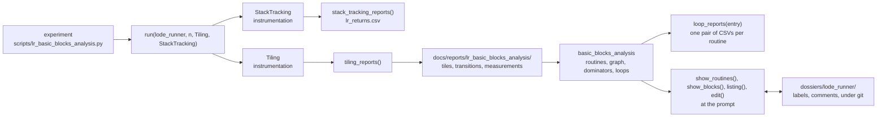

# papple2 -- Workbench

For the reverse engineer: the commands at the prompt, the experiments, the reports, and the words for all of it. `README.md` has the short version.

---

## Overview

Since 2026-10-02, `papple2.workbench` holds two kinds of packages, connected by files in a folder, and the tools for looking at what they found. Since 2026-10-04 all of it is used through commands, by experiments and at the prompt alike.

- **Instrumentation packages** watch a running `Emulator` through its hooks -- after every instruction, or after reads and writes of memory -- and write reports into a folder given by the caller. The `-ing` suffix marks them: `Tiling` in `tiling.py`; `StackTracking` in `stack_tracking.py` (since 2026-10-04), a shadow stack that sorts every `RTS` by the frame its `JSR` opened and writes `lr_returns.csv`. `run()` attaches any number of them, as classes it builds on the booted machine.
- **Analysis packages** need no `Emulator`: they read reports from a folder and return plain values or write reports of their own, so they also run on fixture files. Reading is kept apart from the logic. `basic_blocks_analysis.py` reads the split reports, builds a graph of basic blocks, finds dominators and natural loops, and writes the loop reports.
- **The shell** (`shell.py`) holds the commands: the functions meant for the prompt and for experiments. It keeps three pieces of state, one of each at a time: the reports folder, the dossier, and the current run. `dis(emulator, start, end, labels, graph, comments)` disassembles a range from memory after the run, with labels in the operands and in a column of their own, comments behind the instructions, and the jumps the run took drawn as arrows in a gutter on the left; `listing()` is `dis()` on the current run with the dossier's labels and comments; `edit()` shows the same lines in the listing editor, see below. `hexdump()` shows the memory as bytes and text. The commands that show something return it as text, which IPython shows as `Out[n]` and keeps in `_`; `clip()` copies it.
- **The dossier** (since 2026-10-03) is everything we know about one program, in a folder of its own: `dossiers/lode_runner/`, under git (unlike `data/`). Today it holds `annotations.json`, the labels and comments, kept by `Annotations` in `annotations.py`: every change is written at once, sorted by address, one entry per line. Every change reads the file first, and every command that shows labels reads it before it shows, so two IPython sessions can work on one dossier. `use_dossier()` opens it, and starts a new one with the Apple II's standard labels. Snapshots (outside git) may follow. Unlike the reports, which every run rebuilds, the dossier only changes by hand.



`scripts/walkthrough.py` takes a tiny program through the same pipeline: twenty bytes, two nested loops and one `JSR`, small enough to follow by hand; its labels are still typed into `NAMES`. Everything the pipeline finds is observed structure: only what ran in this run.

Ranges are half-open throughout the workbench: a block printed as `6004-6007` holds the bytes `$6004` to `$6006`, its length is `end - start`, and the next block starts where it ends. `dis()` takes the same ranges.

## Experiments and recipes

An **experiment** is one `lr_` script in `scripts/`. Its **recipe** is the part that wires up the run and writes the reports: a few lines of commands, the same ones you could type at the prompt. The recipe of `lr_basic_blocks_analysis.py`, without its command-line arguments:

```python
use_reports_folder(Path("docs/reports/lr_basic_blocks_analysis"))
use_dossier(Path("dossiers/lode_runner"))
run(lode_runner, 4_000_000, Tiling, StackTracking)
tiling_reports()
stack_tracking_reports()
loop_reports(0x0800)
```

The rest of an experiment can do analysis of its own, or offer functions of its own: `overview()` in `lr_overview.py`, which works from reports alone, is one. A function that proves useful beyond its experiment graduates to `shell.py`, as `show_blocks()`, `listing()` and `loop_reports()` did from `lr_basic_blocks_analysis.py`.

`run()` only runs: it boots the program setup headless, builds and attaches the instrumentations, runs, and detaches them. What gets written afterwards is the experiment's choice, one command per kind of report: `tiling_reports()` writes the tiling reports into the reports folder and builds the run's routines and run graph from them, since the files are the only connection. Each experiment writes into a reports folder of its own, `docs/reports/<experiment>/`, under git. The reports of other experiments are read by their full paths, by convention, as `lr_overview.py` reads `docs/reports/lr_tiles/`.

## At the prompt

The usual way in is to `%run` the experiment to work on, then use the commands:

```python
%run scripts/lr_basic_blocks_analysis.py
show_routines()
show_blocks(0x6238)
listing(0x7a3e)               # one argument: the whole routine
edit(0x7a3e)                  # edit the whole routine, i.e. add labels and comments
label(0x7a3e, "lookup_hgr")
listing("lookup_hgr")         # a label wherever a routine's address goes
show_callers("lookup_hgr")    # every call site that leaps into it
hexdump("hgr_rows_lo")        # one page of memory, as bytes and text
clip()                        # the last output to the clipboard
```

`edit()` opens the listing editor, `papple2.workbench.listing_editor`, under the prompt; it disappears again when you leave with `q` or Esc. Enter on a `JSR` opens the routine it calls, Enter on a branch moves the bar to its target, Backspace goes back and `f` forward again; the breadcrumbs in the rule above the listing show the routines followed into, and in grey those `f` goes to. `g` opens a picker with every routine of the run, to go to one; `u` opens it on the callers of the routine shown, and Enter lands on the call site. Only the code the run executed is listed: every gap that never ran is one grey line, e.g. `... 0803-2800: 8,189 bytes never ran ...`. Tab edits the label of the bar's row and then that of the address its operand names, zero page included; `e` edits the row's comment; `c` copies the visible lines. Every change goes into the dossier at once. Each routine opens again as it was left, as long as the run lasts. The keys, Ctrl keys for editing included, are in the module's docstring.

What `%run scripts/lr_basic_blocks_analysis.py` leaves in the session:

| Kind | Names                                                                                                                                                         |
|---|---------------------------------------------------------------------------------------------------------------------------------------------------------------|
| Commands: setting up | `use_reports_folder()`, `use_dossier()`, `run()`, `tiling_reports()`, `stack_tracking_reports()`                                                              |
| Commands: the current run | `show_routines()`, `show_blocks()`, `show_callers()`, `show_routine_graph()`, `listing()`, `hexdump()`, `edit()`, `loop_reports()`                        |
| Commands: the clipboard | `clip()`                                                                                                                                                    |
| Commands: the dossier | `label()`, `comment()`, `unlabel()`, `uncomment()`                                                                                                            |
| Commands on objects | `print_routines()`, `print_blocks()`, `print_edges()`, `print_loops()`, `dis()`, `set_current_run()`                                                          |
| For a run of your own | `lode_runner` (a program setup, a module: lowercase), `Tiling` and `StackTracking` (instrumentations, classes: capitalized)                                   |
| Machinery | `shell`, and through it `shell.run_emulator`, `shell.run_instrumentations`, `shell.routines`, `shell.run_graph`, `shell.run_transitions`, `shell.annotations` |
| The experiment's own | `REPORTS_FOLDER`, `DOSSIER`, `parse_arguments()`, `arguments`, `entry`, `argparse`, `Path`                                                                    |

The commands are the contract: documented here, and kept working. The machinery is there for debugging and curiosity, with no guarantee. Reach it through the module, as `shell.routines`: a name imported from the module (`from papple2.workbench.shell import routines`, or `import *`) keeps the value it had at import time.

## Experiments in `scripts/`

- **The `lr_*` experiments:** headless experiments on Lode Runner's attract play, each with a reports folder of its own (see "Experiments and recipes" above).
  - `lr_basic_blocks_analysis.py`: written as a recipe; every routine of the run, the tiling reports, the stack tracking's `lr_returns.csv`, and the loop reports of `$0800` (more with `--loop-reports`) into `docs/reports/lr_basic_blocks_analysis/`, under git. Made for `%run` in IPython as well, where it opens Lode Runner's dossier.
  - `lr_overview.py`: works from reports alone. Reads three tiling reports from `docs/reports/lr_tiles/` by their full paths, and writes the whole run -- totals, one line per routine with the routines it calls, the pieces in no routine, and each routine's loops -- into `docs/reports/lr_overview/`. Its `overview()` is its own, not a command.
  - Early experiments, frozen (2026-10-04): written before the recipes, with run code of their own, writing into `tmp/`. Kept as they are, as reminders and placeholders. `lr_count.py`: a 256x256 map of the memory, one cell per address, showing which addresses ran as opcode, operand or immediate (PNG and HTML). `lr_tiles.py`: the tiling instrumentation's reports into `tmp/lr_tiles/`; `docs/reports/lr_tiles/` is a copy made by hand, which `lr_overview.py` reads.
- **`walkthrough.py`:** a tiny program through the whole pipeline, reports into `tmp/walkthrough/`; made for `%run` in IPython, and the model for `tests/test_walkthrough.py`.

## Glossary

- **Hats:** the roles the user works in, each with its own question and its own artefacts. The **reverse engineer** asks what the code does (the prompt, the dossier, the reports); the **product manager** asks what the workbench should let me do, and in what order (`GOALS.md`, `TODO.md`, the contract in this document); the **developer** asks how it works and whether it is right (PyCharm, patches, tests). At the prompt, the reverse engineer notes what feels awkward instead of fixing the tool. In conversation, a prefix names the hat: "RE:", "PM:", "Dev:".
- **Experiment:** one `lr_` script in `scripts/`: a recipe, and whatever analysis or functions of its own it adds. Some experiments only read the reports of others (`lr_overview.py`).
- **Recipe:** the part of an experiment that wires up the run and writes the reports: a few lines of commands, the same ones you could type at the prompt. No object of its own.
- **Command:** a function in `shell.py` meant for the prompt and for experiments. The commands are the **contract** between `papple2`'s developers and its reverse engineers: documented, and kept working.
- **Machinery:** everything else reachable at the prompt (`shell.run_emulator`, `shell.routines`, ...): there for debugging and curiosity, with no guarantee.
- **Graduate:** a function moves from its experiment into `shell.py`, once it proves useful beyond it.
- **Program setup:** how `papple2` loads and starts one program, a module in `papple2.programs`: `lode_runner`. Not the program, not its dossier.
- **Run:** one execution of a program setup for a number of instructions, with instrumentations attached. The **current run** is the one the commands work on. There is one at a time; a second one means a second terminal.
- **Instrumentation:** a class whose objects watch a run through the emulator's hooks: after every instruction, or after reads and writes of memory. `Tiling`, or a class typed at the prompt.
- **Report:** a file an experiment writes. The reports carry meaning on their own, they are easy to work with.
- **Reports folder:** an experiment's home, `docs/reports/<experiment>/`: where its reports go, and where it reads its own. One at a time.
- **Dossier:** everything we know about one program, a folder under git: `dossiers/lode_runner/`. Not its annotations: they are one part of it, and snapshots may follow.
- **Annotations:** the labels and comments in a dossier, by address, in `annotations.json`.
- **Label:** the name of one address; one text names one address only. Snake case: `lookup_hgr`; the Apple II's standard labels stay uppercase (`r:KBD`), so they stand out.
- **`show_` and `print_`:** a `show_` command works on the current run and takes at most an address or a label; a `print_` function takes the objects it prints. A `show_` command returns what it shows as text, as `listing()` and `hexdump()` do, for IPython to show as `Out[n]` and `clip()` to copy; a `print_` function prints.
- **Tile:** a run of instructions from an entry point to the leap that leaves it, as recorded. Tiles as recorded ("unbroken") may overlap.
- **Target:** the address an operand names: `$1a85` in `LDA $1a85,Y`, the pointer `$1b` in `STA ($1b),Y`, a branch's target. `edit()`'s Operand field labels it.
- **Leap:** a branch, `JMP`, `JSR`, `RTS`, `RTI` or `BRK`. **Glide:** the CPU runs on into the next instruction, without a leap.
- **Split tile:** a tile cut at every entry point inside it; split tiles do not overlap. Each split tile becomes one **basic block** of the graph; the graph's connections are **edges**. A **call fall-through edge** joins the block holding a `JSR` to the block behind it, instead of an edge into the callee.
- **Routine:** the code reachable from an entry -- the run's start, a `JSR` target, or a stack jump's target -- without following calls, and ending where another routine begins. Shared code still blurs it.
- **Shadow stack:** a second stack outside the machine, kept by `StackTracking`. Each `JSR` opens a **frame** (call site, entry, expected return), keyed by `SP` before the call; each `RTS` closes the frame at the `SP` it returns to. **Outcomes:** matched (returned where expected), redirected (the return address was rewritten), unmatched (no frame there: bytes pushed by hand, e.g. `PHA`/`PHA`/`RTS`), abandoned (a frame that can never return), open (still open when the run stopped). A tail call is matched: it shows as a frame closed in another routine's code.
- **Stretch:** reserved for a future container of reports.
